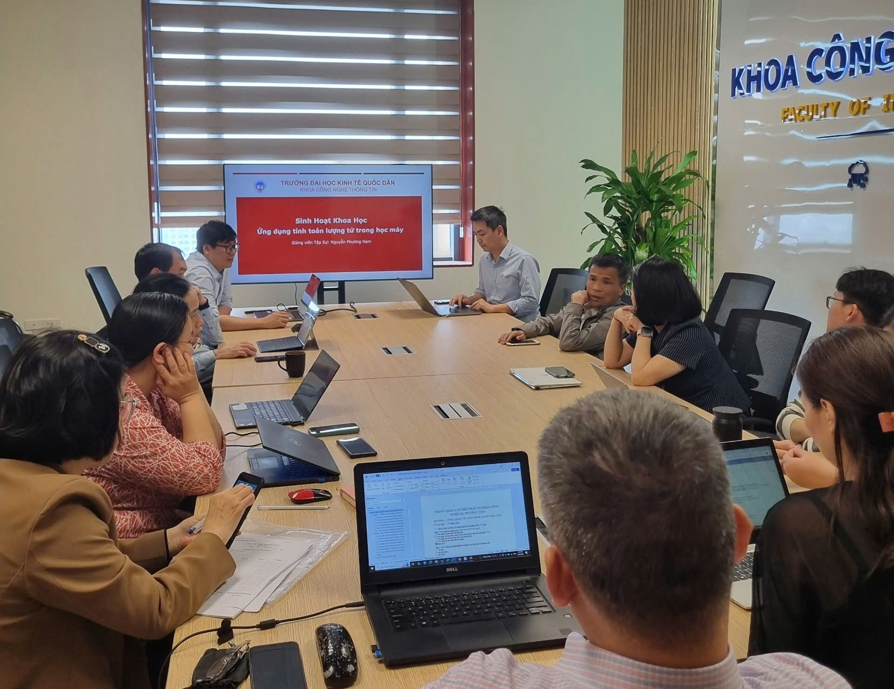

# Sinh hoạt khoa học tháng 3/2025: "Ứng dụng tính toán lượng tử trong học máy"
*28 tháng 03 2025, 20:01*
Nguyen Phuong Nam
Chiều ngày 28/3/2025, Khoa Công nghệ thông tin (CNTT) - Trường Công nghệ - Đại học Kinh tế Quốc dân đã tổ chức buổi sinh hoạt khoa học với chủ đề  “Ứng dụng tính toán lượng tử trong học máy”  với phần trình bày của ThS Nguyễn Phương Nam.

## Giới thiệu
Tính toán lượng tử (Quantum Computing) là một lĩnh vực của khoa học máy tính sử dụng các nguyên lý cơ học lượng tử để xử lý thông tin. Thay vì sử dụng bit như máy tính cổ điển (chỉ có hai trạng thái 0 hoặc 1), máy tính lượng tử sử dụng qubit (quantum bit), có thể tồn tại đồng thời ở trạng thái 0 và 1 nhờ vào tính chất chồng chập (superposition). Ngoài ra, qubit cũng có thể liên kết với nhau thông qua vướng víu lượng tử (entanglement), giúp xử lý thông tin một cách song song và mạnh mẽ hơn rất nhiều so với máy tính truyền thống.

Bài viết trên Cổng thông tin Khoa học và Công nghệ Việt Nam nhấn mạnh rằng sự phát triển của công nghệ điện toán lượng tử hiện nay là một nỗ lực toàn cầu, với sự tham gia tích cực của các công ty và chính phủ trên khắp các châu lục. Các quốc gia hàng đầu đã thực hiện các khoản đầu tư chiến lược nhằm chiếm lĩnh một phần chuỗi cung ứng điện toán lượng tử trong tương lai, đảm bảo khả năng tiếp cận và độc lập chiến lược với các công nghệ tiên tiến. Công nghệ lượng tử bao gồm nhiều lĩnh vực như điện toán lượng tử, thiết bị y tế, cảm biến có độ nhạy cao, liên lạc an toàn và đồng hồ nguyên tử. Trong đó, điện toán lượng tử là một phần quan trọng, hứa hẹn thay đổi cách chúng ta hiểu và ứng dụng vật lý, toán học và khoa học máy tính. Các tập đoàn công nghệ lớn như IBM, Google, Microsoft, Alibaba và Amazon đang đầu tư mạnh mẽ vào lĩnh vực này, đặc biệt tại Hoa Kỳ, nơi hơn 80% kinh phí cho nghiên cứu lượng tử đến từ khu vực tư nhân. Năm 2021, đầu tư tư nhân toàn cầu vào công nghệ lượng tử đạt khoảng 1,4 tỷ USD và dự kiến vượt 2 tỷ USD vào năm 2022, tập trung chủ yếu vào các công ty khởi nghiệp phát triển phần cứng điện toán lượng tử. Tính đến đầu năm 2022, có 46 công ty trên toàn thế giới đang tích cực phát triển phần cứng điện toán lượng tử. Sự gia tăng của các công ty khởi nghiệp trong lĩnh vực này thu hút vốn đầu tư từ khắp nơi trên thế giới, cho thấy tiềm năng và sự phát triển mạnh mẽ của công nghệ lượng tử trong tương lai gần.

Quyết định số 569/QĐ-TTg ngày 11/5/2022 của Thủ tướng Chính phủ ban hành Chiến lược phát triển khoa học, công nghệ và đổi mới sáng tạo đến năm 2030. Quyết định này nhấn mạnh rằng phát triển khoa học, công nghệ và đổi mới sáng tạo là quốc sách hàng đầu, đóng vai trò đột phá chiến lược trong giai đoạn mới, trong đó nghiên cứu và làm chủ công nghệ lượng tử là một thành tố được đề cập. Đây là động lực chính thúc đẩy tăng trưởng, tạo bứt phá về năng suất, chất lượng, hiệu quả; và là nhân tố quyết định nâng cao năng lực cạnh tranh của quốc gia, các ngành, lĩnh vực kinh tế - xã hội, địa phương và doanh nghiệp. Đồng thời, đây cũng là nền tảng để thực hiện chuyển đổi số quốc gia, góp phần quan trọng nâng cao đời sống nhân dân, phát triển bền vững, đảm bảo quốc phòng và an ninh.

Bài viết "Phát triển và ứng dụng công nghệ thông tin lượng tử (phần 1)" trên Tạp chí An toàn thông tin nhấn mạnh rằng công nghệ thông tin lượng tử (CNTT lượng tử) là một phần quan trọng của công nghệ lượng tử, bao gồm ba lĩnh vực chính: điện toán lượng tử, truyền thông lượng tử và đo lường lượng tử. Sự phát triển của CNTT lượng tử đang thúc đẩy ứng dụng các kết quả nghiên cứu cơ bản và xây dựng hệ sinh thái công nghiệp công nghệ lượng tử, trở thành mối quan tâm hàng đầu của nhiều quốc gia. Các cường quốc công nghệ đã tăng cường xây dựng chính sách và đầu tư vào R\&D trong lĩnh vực CNTT lượng tử. Tính đến tháng 9/2022, tổng đầu tư toàn cầu đã vượt 16 tỷ USD, với sự đóng góp từ quỹ nghiên cứu chính phủ, đầu tư của các doanh nghiệp công nghệ lớn và vốn đầu tư xã hội. Các tập đoàn như IBM, Google, Intel và Microsoft liên tục đầu tư vào điện toán lượng tử, thúc đẩy nghiên cứu và phát triển sản phẩm mẫu, cũng như thăm dò ứng dụng thương mại hóa. Về đổi mới công nghệ, lĩnh vực điện toán lượng tử chứng kiến sự gia tăng nhanh chóng về số lượng đăng ký bằng sáng chế, tiếp theo là truyền thông lượng tử và đo lường lượng tử. Mỹ và Trung Quốc dẫn đầu về đổi mới trong các lĩnh vực này, với Mỹ chiếm ưu thế trong điện toán lượng tử, còn Trung Quốc dẫn đầu trong truyền thông và đo lường lượng tử. Hiện tại, CNTT lượng tử đang chuyển từ giai đoạn nghiên cứu cơ bản và thử nghiệm sang phát triển sản phẩm và thương mại hóa, với mục tiêu xây dựng hệ sinh thái công nghiệp công nghệ lượng tử mạnh mẽ trong tương lai. Phân tích rủi ro trong các khoản đầu tư về lĩnh vực này đã được công bố trên tạp chí Digital Finance bởi nhóm nghiên cứu tại QAAA Lab. 

 

Nội dung của buổi seminar bao gồm ba báo cáo khoa học được thực hiện tại: The Quantum Initiative, Đại Học Nam Florida và G.A.I.A QTech, Vietnam; bao gồm:

Nguyen, N. and Chen, K.C., 2022. Quantum embedding search for quantum machine learning. IEEE Access, 10, pp.41444-41456.
Nguyen, N. and Chen, K.C., 2022. Bayesian quantum neural networks. IEEE Access, 10, pp.54110-54122. 
Nguyen, P.N., 2024. The duality game: a quantum algorithm for body dynamics modeling. Quantum Information Processing, 23(1), p.21.

## Thiết kế tối ưu mạch logic cho học máy trên máy tính lượng tử
Bài báo này giới thiệu một thuật toán tìm kiếm tự động (QES, phát âm là “quest”), nhằm tìm ra thiết kế tối ưu của sơ đồ liên đới trong học máy lượng tử có giám sát. Trước tiên, chúng tôi thiết lập mối liên hệ giữa cấu trúc của sự liên đới sử dụng cổng CNOT và biểu diễn của đồ thị đa hướng, từ đó xác định một không gian tìm kiếm rõ ràng. Phương pháp mã hóa đề xuất, trong đó sự liên đới lượng tử được biểu diễn dưới dạng vectơ kiểu gen, giúp kết nối tối ưu hóa ansatz với học máy cổ điển, cho phép tìm kiếm hiệu quả trên bất kỳ không gian tìm kiếm nào được xác định tốt. Tiếp theo, chúng tôi đề xuất mức độ liên đới nhằm giảm bớt số lượng phần tử trong không gian tìm kiếm xuống mức có thể triển khai thực tế. Cuối cùng, chúng tôi giảm chi phí đánh giá hàm mất mát thực sự bằng cách sử dụng các mô hình thay thế thông qua tối ưu hóa dựa trên mô hình tuần tự. Chúng tôi chứng minh tính khả thi của phương pháp đề xuất trên các bộ dữ liệu mô phỏng và tiêu chuẩn, bao gồm Iris, Wine và Breast Cancer. Kết quả thực nghiệm cho thấy kiến trúc nhúng lượng tử được QES tìm ra có hiệu suất dự đoán vượt trội so với các thiết kế thủ công.

## Mạng nơ ron Bayesian trên máy tính lượng tử
Mục tiêu chính của lĩnh vực này thường là:
(1) khám phá các lợi thế lượng tử tiềm năng trong các nhiệm vụ học máy cổ điển, hoặc
(2) tận dụng các thuật toán học máy cổ điển đã được thiết lập để giải quyết các vấn đề liên quan đến lượng tử trên các thiết bị lượng tử quy mô trung gian nhiễu (NISQ).

Theo hướng nghiên cứu thứ hai, chúng tôi nghiên cứu Mạng Nơ-ron Lượng tử (Quantum Neural Networks - QNNs) nhằm thực hiện học Bayesian. Khi quan sát nhiều nghiên cứu về QNNs, trong đó phương pháp huấn luyện duy nhất là dựa trên tần suất (frequentist training), chúng tôi nhận thấy rằng học Bayesian mang lại hai lợi ích cho QNNs:

Thứ nhất, các mô hình huấn luyện theo Bayesian có mức độ tổng quát hóa cao hơn nhờ việc sử dụng phân phối tiên nghiệm (prior) và hậu nghiệm (posterior), điều này sẽ được chứng minh thông qua nghiên cứu lý thuyết về độ phức tạp mô hình trong bài báo này.

Thứ hai, suy luận Bayesian cung cấp khả năng ước lượng độ bất định mang tính nhận thức (epistemic uncertainty), giúp cải thiện quá trình ra quyết định. Điều đáng chú ý là các QNNs được huấn luyện theo phương pháp tần suất thường thiếu tính chất quan trọng này.

Dưới quy trình huấn luyện Bayesian, các mô hình mà chúng tôi phát triển có thể được xem là một lớp QNNs mới (gọi là BayesianQNNs), vừa kế thừa các đặc tính mong muốn của suy luận Bayesian vừa duy trì hiệu suất dự đoán tương đương với các mô hình huấn luyện theo phương pháp tần suất. Đề xuất về Mạng Nơ-ron Lượng tử Bayesian này được xác minh thông qua bằng chứng thực nghiệm từ các thí nghiệm số.

## Trò chơi đối ngẫu
Nghiên cứu này giới thiệu một thuật toán lượng tử mới, được gọi là trò chơi đối ngẫu (duality game), được thiết kế để giải quyết các thách thức trong mô hình động lực học chất điểm. Tính thực tiễn và hiệu quả của thuật toán đề xuất được làm sáng tỏ thông qua ba kịch bản dữ liệu khác biệt:

(1) xấp xỉ mô hình tăng trưởng cổ điển von Bertalanffy trong điều kiện có nhiễu ngẫu nhiên (mô phỏng),
(2) mô hình hóa gánh nặng khối u cá nhân hóa trên tập dữ liệu quy mô nhỏ, và
(3) mô hình hóa sự gia tăng dân số mắc COVID-19 sử dụng phân tích dữ liệu lớn.

Hiệu suất của thuật toán trong các kịch bản này nhấn mạnh tiềm năng ứng dụng thực tế ở quy mô lớn. Hơn nữa, các phát hiện của nghiên cứu khơi dậy kỳ vọng về triển vọng của thuật toán trong lĩnh vực đang phát triển của trí tuệ nhân tạo lượng tử dựa trên cơ sở vật lý (physical-based quantum AI). Thông qua trò chơi đối ngẫu, nghiên cứu đề xuất một hướng tiếp cận mới trong việc giải quyết các bài toán thực tiễn về động lực học cơ thể, mở ra những cơ hội mới cho nghiên cứu và phát triển trong lĩnh vực AI lượng tử, nhằm khai thác các lợi thế tính toán lượng tử để giải quyết các bài toán mô hình hóa vật lý phức tạp.